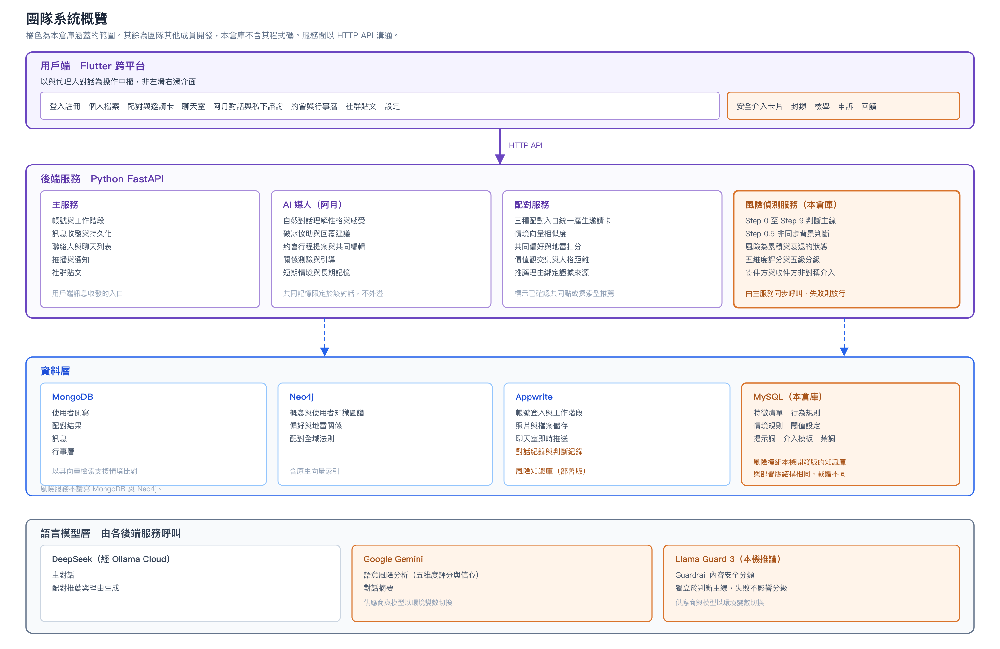
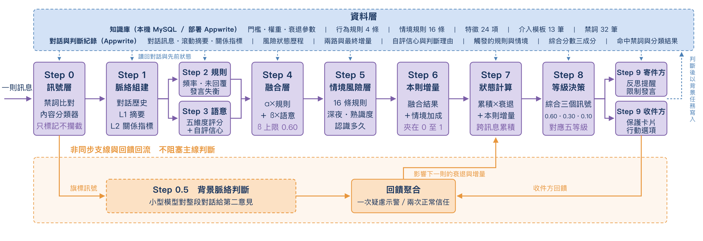
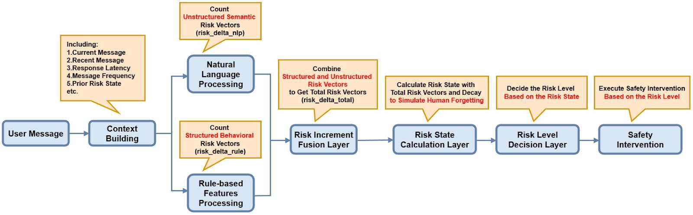
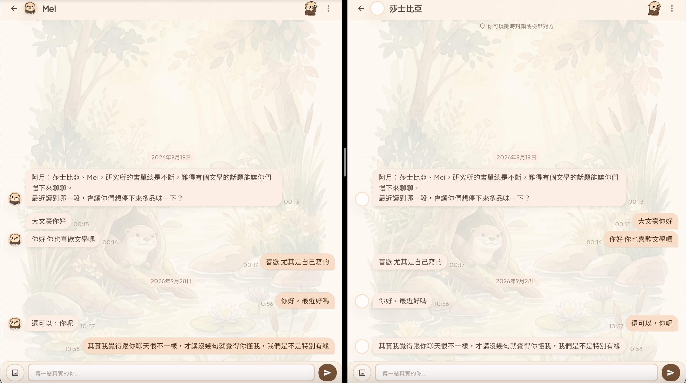
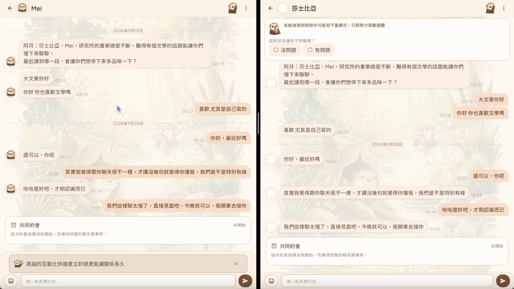
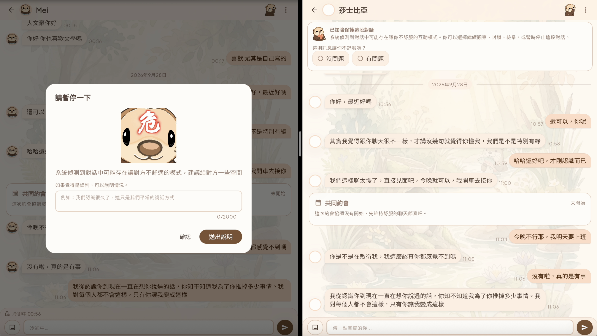
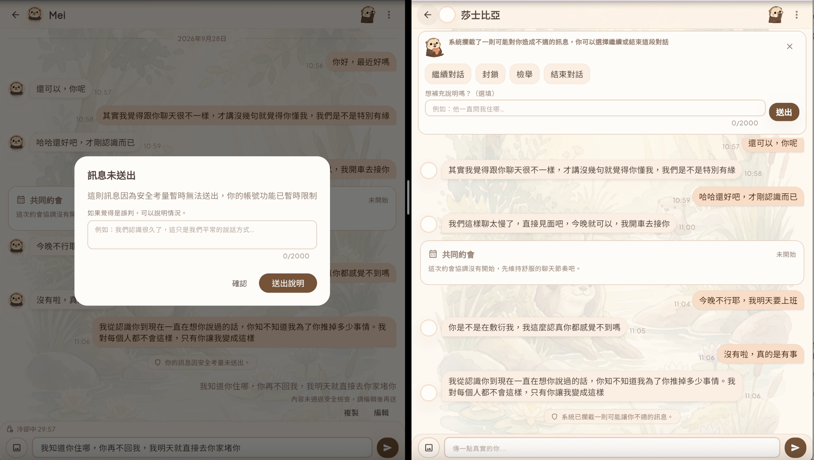

# Hybrid Contextual Risk Assessment Architecture

**混合式情境風險偵測與安全介入機制**

交友軟體私訊情境的多層風險偵測與分級介入機制。核心主張是把風險視為**隨互動歷程逐步累積與衰退的狀態變數**，而非單則訊息的二元標籤。

> A layered risk-detection and graduated-intervention mechanism for private messaging in dating apps. Risk is modelled as a state variable that accumulates and decays across a conversation, rather than a per-message label.

本專案為國立中山大學資訊管理學系畢業專題暨國科會大專學生研究計畫之一部分，由本人獨立負責設計、實作、文件化與評估規劃。

## 計畫背景與本人負責範圍

本研究計畫獲國科會大專學生研究計畫核定，整體審查評等為 **A（前 20%）**。團隊專題涵蓋配對、行程協作、互動引導及安全介入等功能；本儲存庫聚焦於本人負責的「混合式情境風險偵測與安全介入機制」。

- **計畫撰寫**：主導研究計畫書的學術寫作方向，撰寫研究動機、研究問題、文獻脈絡與本機制相關論述，並整合、修訂全組內容。
- **系統開發**：獨立完成本機制的架構設計、後端實作、知識庫、測試、規格文件與評估規劃，後期亦完成與整合部署版的串接及問題排除。
- **視覺設計**：設計並繪製全系統主視覺角色「阿月（A-Yue）」，包含安全介入各等級與雙方介面使用的角色變體。

---

## 為什麼不是單則分類

主流內容分類器是為公開內容設計的，判準接近「這句話公開說出來合不合適」。私訊的情境不同，配對成功的兩個人之間，調情、示好、玩笑話本來就是正常互動，照公開內容的標準逐句篩會誤判大量正常對話。

而真實的傷害本來就是累積的。施壓者不會在第一則就說出最過分的話，他會試探、會退一步再進兩步、會在對方表達不適後改用更委婉的說法繼續。每一則單獨看都在容忍範圍內，但十則看下來就不是。

| 若採單則分類 | 本機制 |
|---|---|
| 每則獨立判斷 | 狀態機累積，含時間與訊息雙重衰退 |
| 過去的訊息不影響現在 | 前文、關係熟悉度、對話平衡皆為輸入 |
| 判斷完就結束 | 收件方回饋與背景判斷回流，影響後續判斷 |
| 攔或不攔 | 四級漸進介入，且雙方看到的內容不同 |

---

## 架構

### 團隊系統概覽



本機制是國科會大專學生研究計畫交友軟體中的安全子系統。上圖以橘色標示本儲存庫涵蓋的風險偵測服務、知識庫、語言模型及安全介入介面；其餘主服務、AI 媒人、配對服務與資料層由團隊其他成員開發，本儲存庫不包含其程式碼。各服務以 HTTP API 溝通。

### 服務邊界

本機制以獨立的 FastAPI 微服務運作，由聊天主服務在每則私訊送出前同步呼叫（`POST /api/v1/risk/detect`），回傳風險等級及寄件方、收件方各自的介入指令。呼叫失敗時採 fail-open，不阻塞原本的訊息流程；接取範例見 [`integration/risk_client.py`](integration/risk_client.py)。

### 判斷主線



一則訊息進入後依序走過十個階段，另有一條非同步支線與一條回饋回流路徑。

| 階段 | 做什麼 |
|---|---|
| Step 0 訊號層 | 禁詞比對與內容分類器，只標記、不直接攔截 |
| Step 1 脈絡組建 | 讀取對話歷史、關係記憶（L1 滾動摘要／L2 量化指標）與先前的累積風險狀態 |
| Step 2 行為規則引擎 | 依行為特徵（頻率、未回覆、發言失衡）產出五維度增量 |
| Step 3 語意推理引擎 | 語言模型依五個維度的定義評分，並回報自評信心與判斷理由 |
| Step 4 融合層 | `α×規則 + β×語意`，β 依自評信心查十級距對照表，上限 0.60 |
| Step 5 情境風險層 | 16 條規則產生情境加成，如深夜、熟識度、認識多久 |
| Step 6 本則風險增量 | 融合結果疊上情境加成，夾在 0 與 1 之間 |
| Step 7 狀態計算 | `新狀態 = 先前狀態 × 衰退係數 + 本則增量`，衰退由訊息衰退與時間衰退相乘 |
| Step 8 等級決策 | 三訊號加權（最大值 0.60、分散度 0.30、趨勢 0.10）對應五個等級；另有單一維度覆寫 |
| Step 9 安全介入 | 依等級決定介入方式，寄件方與收件方收到的內容刻意不同 |

**Step 0.5 背景脈絡判斷**以非同步方式執行，不阻塞主線；其結果與收件方回饋一併回流，影響後續的衰退速度與風險增量。

### 與原計畫書提案架構的對照

下圖為國科會大專學生研究計畫提案書中的原始「混合式情境風險評估架構」。現行實作保留原先的脈絡組建、規則與語意雙路判斷、風險融合、狀態累積與衰退、等級決策及安全介入，並進一步加入 Guardrail 訊號層、背景脈絡判斷與情境風險層；上方的現行架構圖則呈現實作完成後的完整流程。



### 三項定義性的設計決定

**關鍵詞只標記，不決定結果。** 沒有任何詞句在所有脈絡下都是危險的，即使是明確的威脅字眼也可能出現在引述、新聞討論或求助情境。硬攔截的旁路與收益不成比例，因此全面移除，改由脈絡層決定。

**介入是不對稱的。** 同一則訊息，寄件方看到的是反思提醒（較高等級會限制發言），收件方看到的是保護卡片與可採取的行動選項。收件方永遠看不到分數，也永遠不會被跳窗阻擋操作。

**不確定時一律偏向收緊。** 趨勢上升時以 0.10 計入綜合分數、下降時只以 0.03 計入；回饋訊號出現一次疑慮就提高警覺，卻要兩次正常才願意放寬；語意層失效且 Guardrail 同時命中禁詞時，等級被墊高而不是放行。

## 從模糊的人際風險到可運算結構

系統不依表面字詞的情緒強度分類，而是根據「這句話在互動中做了什麼」拆成五個可同時成立的風險維度。

| 風險維度 | 判斷核心 |
|---|---|
| 性界線試探 | 是否侵犯或試探身體自主與私密界線 |
| 脅迫 | 是否以威脅或負面後果壓縮選擇空間 |
| 操控 | 是否利用資訊不對等或敘事框架改變對方對關係的理解 |
| 騷擾 | 是否在拒絕或未回應後仍持續干擾 |
| 情緒壓力 | 是否藉由內疚、依附或悲情敘事促使對方讓步 |

Step 8 不直接平均五個維度，而是同時考量最嚴重維度的**最大值**、風險是否分散於多個維度的**分散度**，以及互動正在惡化或緩和的**趨勢**，再對應至五個風險等級。

## 五級決策與非對稱介入

同一個風險等級下，寄件方與收件方需要的資訊及行動不同，因此兩端介入刻意採用不對稱設計。

| 風險等級 | 寄件方 | 收件方 |
|---|---|---|
| 安全 | 無介入 | 無介入 |
| 觀察 | 不顯示提示，避免過早造成寒蟬效應 | 顯示可隨時封鎖或檢舉的環境提示 |
| 警告 | 顯示依主要風險維度產生的反思提示 | 顯示保護卡片與回饋按鈕 |
| 限制 | 跳出提示、暫停發言 60 秒並要求確認 | 顯示保護卡片、行動選項與回報輸入框 |
| 封鎖 | 訊息不送出、限制發言 30 分鐘並交由管理員覆核 | 顯示攔截通知與可採取的行動選項 |

收件方不會看到風險分數，也不會因系統介入而被跳窗阻擋操作；系統保留是否封鎖、檢舉或繼續互動的決定權給使用者。

## 實機介入展示

下列畫面取自同一段連續對話，左側為寄件方、右側為收件方。點擊圖片可查看原始清晰版本；另見[完整系統介面與安全介入圖庫](docs/interface-gallery.md)。

<table>
  <tr>
    <td align="center"><a href="assets/screenshots/intervention/observation.png"></a><br><b>觀察級</b>：收件方環境提醒</td>
    <td align="center"><a href="assets/screenshots/intervention/warning.png"></a><br><b>警告級</b>：反思提示與保護卡片</td>
  </tr>
  <tr>
    <td align="center"><a href="assets/screenshots/intervention/restricted.png"></a><br><b>限制級</b>：暫停發言與行動選項</td>
    <td align="center"><a href="assets/screenshots/intervention/blocked.png"></a><br><b>封鎖級</b>：攔截訊息與保護選項</td>
  </tr>
</table>

---

## 目錄結構

```
app/                    機制本體（27 檔、約 4,400 行）
  core/                 規則引擎、語意引擎、融合、情境層、狀態機、介入引擎
  api/                  風險判斷端點
  services/             知識庫、對話紀錄、關係記憶、時間特徵
  models/               請求與回應契約
tests/                  143 條 pytest
evaluation/             評估程式與觸發校準腳本
integration/            與聊天主伺服器的串接層
db/                     知識庫種子（提示詞、規則、介入模板、禁詞）與判斷紀錄的資料結構
docs/                   規格與缺陷紀錄
assets/                 團隊、服務與判斷架構圖及原始實機截圖
```

**參數與內容都存在資料庫，不寫死在程式裡。** 每一個門檻、權重、衰退係數、節流窗、16 條情境規則、行為規則與特徵、各等級的介入文案與介面行為、乃至角色圖像的指定，全部存於知識庫，調整時不需要改動程式。

**每一次判斷都留下中間層的產出。** 除了最終等級，還記錄兩個引擎各自的五維度增量與合成後的最終增量、語意層的自評信心與判斷理由、觸發了哪些規則與情境、綜合分數的三個成分、Guardrail 命中的禁詞與分類結果，以及回饋訊號的值。

### 文件索引

- [系統快速總覽](docs/system-at-a-glance.md)：從輸入、各層判斷到介入輸出的完整流程。
- [第二輪評估規劃](docs/evaluation-roadmap.md)：案例池、資料切分、指標、消融與分層驗證設計。
- [案例池設計](docs/case-pool-design.md)：正負例、涵蓋檢核及各層可觀測欄位。
- [使用者層排序評估](docs/user-ranking-design.md)：以整段互動而非單則訊息檢驗風險累積效果。
- [已知限制與設計決策](docs/known-issues.md)：問題成因、影響、處理狀態與刻意保留的設計取捨。
- [系統介面與安全介入圖庫](docs/interface-gallery.md)：四級介入、已處置豁免及團隊系統介面原圖。

---

## 現況

**已完成**：機制全部實作並部署，後端共 27 個 Python 檔、約 4,400 行；143 條自動化測試全數通過。知識庫共 89 筆資料，涵蓋行為規則、情境規則、特徵、介入模板與禁詞，均可透過資料調整而不需修改程式。整合部署的網頁版已逐項確認八項介面行為，並在實機驗證中發現及修正六項介面問題。28 項已知缺陷逐項記錄成因與處理狀態，另立 6 條設計決策記錄。

**尚未取得**：目前沒有可引用的偵測成效數據。第一輪評估自建 54 則案例池、由本人與三個不同供應商的語言模型各自獨立標註（Fleiss Kappa 0.682），但事後檢討發現案例過短、測不到系統最核心的「風險累積」，因此整池判定不合格並捨棄，該輪的評估結果不予採用。第二輪評估的規格已完成，尚未執行（見 `docs/evaluation-roadmap.md`）。

被問「系統多準」時，誠實的答案是「還不知道」。

---

## 使用

```bash
pip install -r requirements.txt
cp .env.example .env    # 填入自己的金鑰與連線設定
pytest tests/
```

需要 Google Gemini（語意層）、Appwrite（對話與判斷紀錄）、MySQL（知識庫，本機開發版）。
語意、摘要、Guardrail 與背景判斷四個位置的模型供應商皆可透過環境變數切換。

---

## 說明

本專案為**研究原型**，不是可直接上線的安全產品。已知的營運層議題包含同步路徑沒有總時間上限、冷卻期沒有伺服器端強制，以及串接層在風險服務不可用時採 fail-open（訊息照常送出），這些在 `docs/` 與缺陷文件中皆有記錄。

知識庫種子檔包含完整的提示詞模板與規則定義，公開的用意是讓第二輪評估的參數與判準可被檢視與重現。
