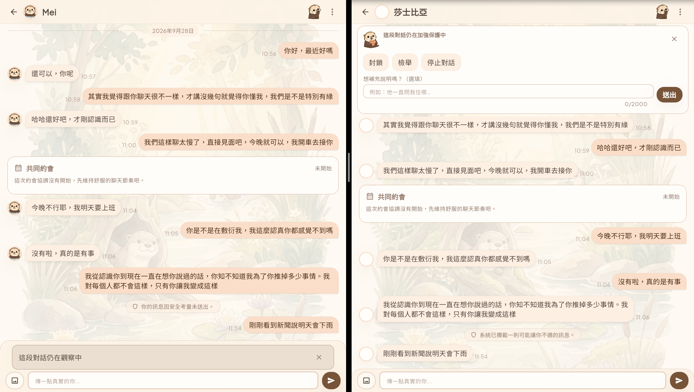
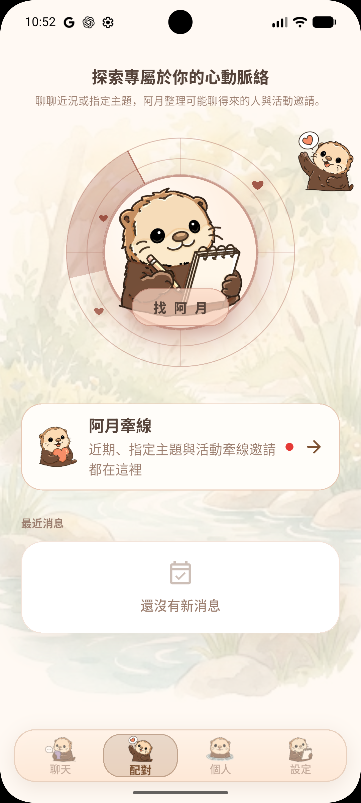
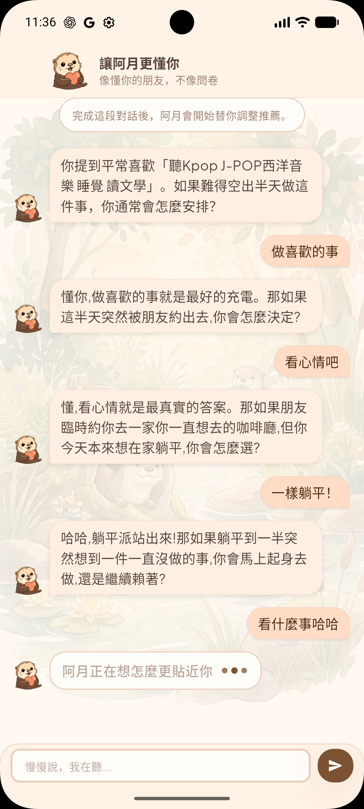
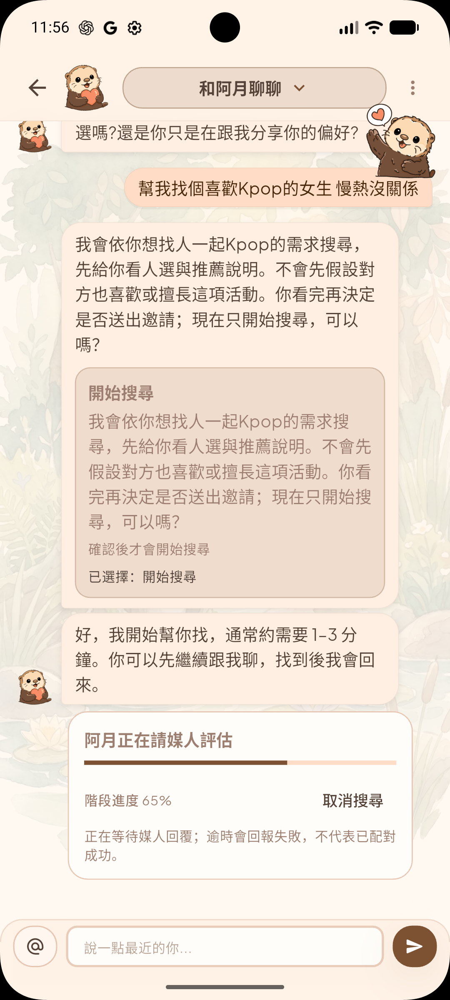
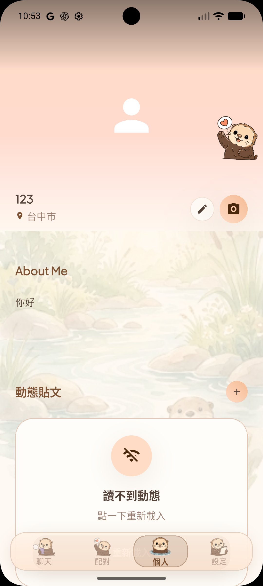
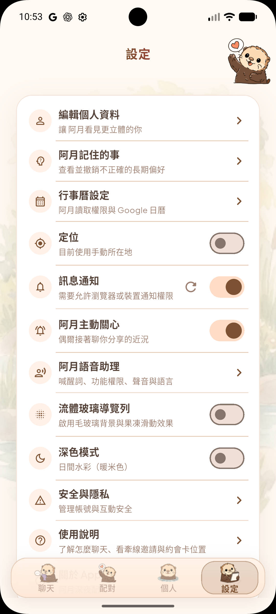
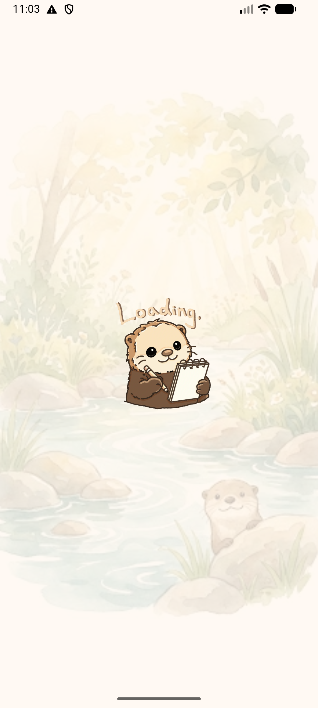

# 系統介面與安全介入圖庫

本頁將兩類畫面分開呈現：第一類是本人負責之風險偵測與安全介入機制的實機畫面；第二類是團隊整體系統介面，用來交代本機制實際整合進何種產品情境。團隊介面不代表全部由本人開發。

## 風險等級與雙方介入畫面

下列五張畫面取自同一段連續對話，左側為寄件方、右側為收件方，對應成果進度報告中的圖（四）至圖（七）及圖（十）。

### 觀察級

寄件方不顯示提示，避免風險剛浮現時造成寒蟬效應；收件方看到可隨時封鎖或檢舉的環境提醒。

### 警告級

寄件方收到依主要風險維度產生的反思提示；收件方看到保護卡片與「沒問題／有問題」回饋按鈕。

### 限制級

寄件方看到暫停提示並進入 60 秒冷卻；收件方看到加強保護說明、封鎖、檢舉、停止對話及補充說明等行動選項。

### 封鎖級

寄件方的訊息不送出，帳號功能暫時受限；收件方收到攔截通知與封鎖、檢舉或結束對話等選項。

### 已處置豁免與持續保護

先前已完成介入且沒有新的風險增量時，系統不為同一事件重複處罰寄件方，但保留累積風險狀態；收件方的保護卡片與行動選項仍持續顯示。

## 團隊系統介面

以下畫面用來呈現風險機制所整合的交友軟體原型及主視覺角色「阿月（A-Yue）」。

<table>
  <tr>
    <td align="center"> 配對與牽線首頁</td>
    <td align="center"> 阿月互動引導</td>
    <td align="center"> 媒人搜尋與進度</td>
  </tr>
  <tr>
    <td align="center"> 個人頁面</td>
    <td align="center"> 設定頁面</td>
    <td align="center"> 載入畫面</td>
  </tr>
</table>

